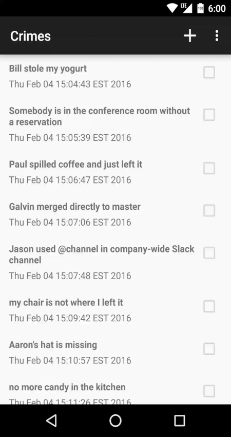

#RecylerView MultiSelect
RecyclerView MultiSelect is a tool to help implement single or multichoice selection on RecyclerView items. It does not provide the same interface as ListView's setChoiceMode(), but can do everything setChoiceMode() does. It is also small with a limited set of responsibilities, which means it should be suitable for coercing into off label uses.


<a href="http://www.methodscount.com/?lib=com.bignerdranch.android%3Arecyclerview-multiselect%3A%2B"></img></a>

## Overview




### Basics

The MultiSelector is the core object that manages multi-selection. However, you have to tell MultiSelector when to enter/leave selection mode.

```
MultiSelector multiSelector = new MultiSelector();
multiSelector.setSelectable(true); // enter selection mode
```

```
MultiSelector multiSelector = new MultiSelector();
multiSelector.setSelectable(false); // leave selection mode
```

You must also tell MultiSelector when an item has been selected.

```
MultiSelector multiSelector = new MultiSelector();
multiSelector.setSelectable(true); // enter selection mode
multiSelector.setSelected(myViewHolder, true); // set myViewHolder to selected
```

Your ViewHolder must implement the SelectableHolder interface. This library provides a default implementation called SwappingHolder that handles the visuals of being selected/unselected.


```
private MultiSelector mMultiSelector = new MultiSelector();

private class MyViewHolder extends SwappingHolder 
            implements View.OnLongClickListener { // (1)

    public MyViewHolder(View itemView) {
        super(itemView, mMultiSelector); // (2)
        itemView.setLongClickable(true);
    }

    @Override
    public boolean onLongClick(View view) { // (6)
        if (!mMultiSelector.isSelectable()) { // (3)
            mMultiSelector.setSelectable(true); // (4)
            mMultiSelector.setSelected(MyViewHolder.this, true); // (5)
            return true;
        }
        return false;
    }
}
```

Create a ViewHolder that subclasses SwappingHolder (1). MultiSelector works through the SelectableHolder interface to communicate to the ViewHolder when it has been selected/deselected. Therefore you must pass MultiSelector to SwappingHolder in the ViewHolder's constructor (2). Ensure MultiSelector is not already in selection mode (3), then enter selection mode (4). Finally set the item as selected (5). In this example, we chose to enter selection mode on long press (6). It is up to you to decide what triggers selection mode.

It is also up to you to notify MultiSelector when an item is clicked during selection mode. However, you will want to notify MultiSelector only during selection mode. When not in selection mode you can handle item clicks normally. 

This library provides a convenience method called tapSelection(). If MultiSelector is in selection mode, this method will toggle the selected state of an item and return true. If MultiSelector is not in selection mode this method returns false.

```
private class MyViewHolder extends SwappingHolder implements View.OnClickListener {

    public MyViewHolder(View itemView) {
        super(itemView, mMultiSelector);
    }

    @Override
    public void onClick(View view) {
        if (!mMultiSelector.tapSelection(MyViewHolder.this)){
            // do whatever we want to do when not in selection mode
            // perhaps navigate to a detail screen
        }
    }
    
    ...
}
```

If you want to enter ActionMode as part of selection mode, it is your responsibility to do so. However this library provides a helper ActionMode.Callback helper class called ModalMultiSelectorCallback.


```
private MultiSelector mMultiSelector = new MultiSelector();

private ModalMultiSelectorCallback mActionModeCallback 
        = new ModalMultiSelectorCallback(mMultiSelector) { // (1)
    ...
};

private class MyViewHolder extends SwappingHolder
        implements View.OnClickListener, View.OnLongClickListener {

	...
	
    @Override
    public boolean onLongClick(View view) {
        if (!mMultiSelector.isSelectable()) {
            ((AppCompatActivity) getActivity()).startSupportActionMode(mActionModeCallback); // (2)
            mMultiSelector.setSelectable(true);
            mMultiSelector.setSelected(MyViewHolder.this, true);
            return true;
        }
        return false;
    }
}
```

First create an instance of ModalMultiSelectorCallback, passing in your MultiSelector (1). Then pass this callback into the system when starting ActionMode (2).

The ModalMultiSelectorCallback exposes all methods in the ActionMode.Callback interface that you would normally use to create/prepare/respond to/destroy the ActionMode menu items:

```
public boolean onCreateActionMode(ActionMode mode, Menu menu);

public boolean onPrepareActionMode(ActionMode mode, Menu menu);

public boolean onActionItemClicked(ActionMode mode, MenuItem item);

public void onDestroyActionMode(ActionMode mode);
```

For this example, we use want to delete items in selection/action mode:

```
private ModalMultiSelectorCallback mActionModeCallback
        = new ModalMultiSelectorCallback(mMultiSelector) {

    @Override
    public boolean onCreateActionMode(ActionMode actionMode, Menu menu) {
        super.onCreateActionMode(actionMode, menu);
        getActivity().getMenuInflater().inflate(R.menu.list_context_menu, menu);
        return true;
    }

    @Override
    public boolean onActionItemClicked(ActionMode actionMode, MenuItem menuItem) {
        if (menuItem.getItemId() == R.id.menu_item_delete) {
            actionMode.finish();

            for (int i = mObjects.size(); i >= 0; i--) {
                if (mMultiSelector.isSelected(i, 0)) { // (1)
                    // remove item from list
                    mRecyclerView.getAdapter().notifyItemRemoved(i);
                }
            }

            mMultiSelector.clearSelections(); // (2)
            return true;

        }
        return false;
    }
};
```

We can access each selected item (1) to remove it from our list. We also need to clear selection when finished removing all items (2).

### Single Selection

To use single selection instead of multiselect, use SingleSelector instead of MultiSelector:

```
private MultiSelector mMultiSelector = new SingleSelector();
```


## Customizing Selection Visuals 

SwappingHolder uses two sets of drawables and state list animators for its itemView: one while in the default mode, and one while in selection mode. You can customize these by calling one of the various setters:

```
public void setSelectionModeBackgroundDrawable(Drawable drawable);
public void setDefaultModeBackgroundDrawable(Drawable drawable);

public void setSelectionModeStateListAnimator(int resId);
public void setDefaultModeStateListAnimator(int resId);
```

The state list animator setters are safe to call prior to API 21, and will result in a no-op.

### Off Label Customization

If you need to customize what the selected states look like beyond what SwappingHolder offers, you can extend the MultiSelectorBindingHolder abstract class to respond to selection events:

```
public class MyCustomHolder extends MultiSelectorBindingHolder {
    @Override
    public void setSelectable(boolean selectable) { ... }

    @Override
    public boolean isSelectable() { ... }

    @Override
    public void setActivated(boolean activated) { ... }

    @Override
    public boolean isActivated() { ... }
}
```

If that's still too restrictive, you can implement the SelectableHolder interface instead:

public interface SelectableHolder {
    void setSelectable(boolean selectable);
    boolean isSelectable();

    void setActivated(boolean activated);
    boolean isActivated();

    int getAdapterPosition();
    long getItemId();
}

It requires a bit more code: you will need to bind your ViewHolder to the MultiSelector by calling MultiSelector.bindHolder() every time your view holder is bound to a different item. On the other hand, though, your implementation doesn't even necessarily have to be hooked up to a RecyclerView, and neither does your MultiSelector. I have no idea how useful that is to anyone, but there you go.


##Download

[v0.2 AAR](http://central.maven.org/maven2/com/bignerdranch/android/recyclerview-multiselect/0.2/recyclerview-multiselect-0.2.aar)

**Gradle**

```
compile 'com.bignerdranch.android:recyclerview-multiselect:0.2'
```

**Maven**

```
<dependency>
	<groupId>com.bignerdranch.android</groupId>
	<artifactId>recyclerview-multiselect</artifactId>
	<version>0.2</version>
</dependency>
```


##Contributing
TODO

##License
TODO
